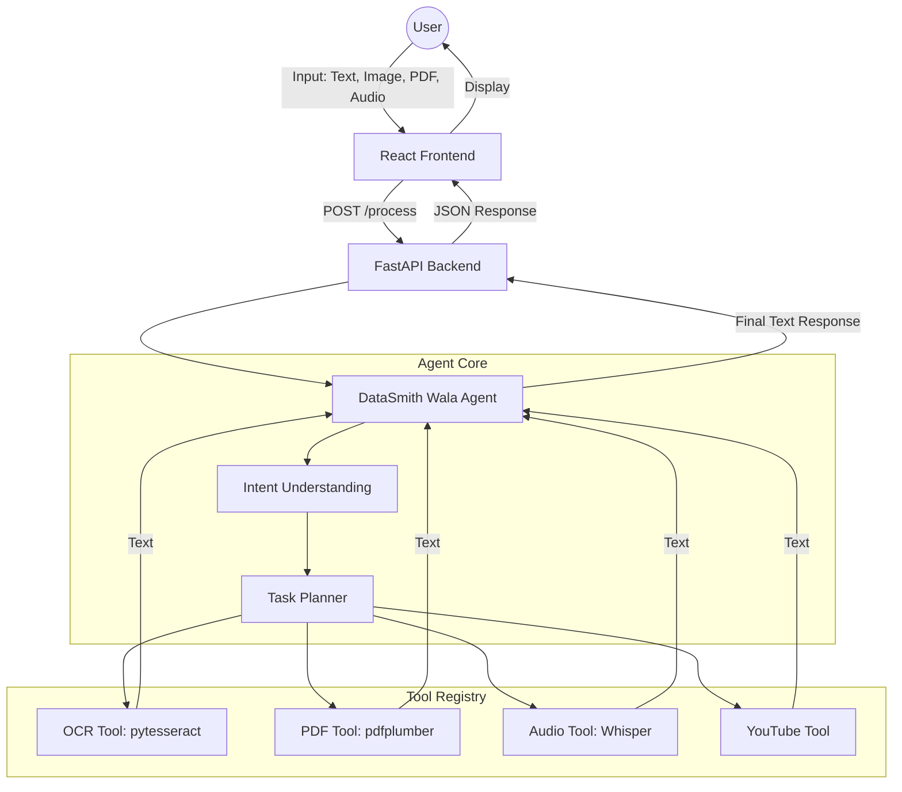

# DataSmith Wala - Agentic Data Processor

DataSmith Wala is an intelligent agent capable of processing multiple input types (Text, Images, PDFs, Audio) and performing complex tasks autonomously.

## Features

- **Multi-Modal Input**: Supports PDF, JPG/PNG, MP3/WAV, and Text.
- **Intelligent OCR**: Extracts text from images and scanned PDFs.
- **Audio Transcription**: Uses OpenAI's Whisper for high-quality audio-to-text.
- **YouTube Integration**: Automatically fetches transcripts from YouTube URLs found in inputs.
- **Agentic Reasoning**: Plans multi-step workflows to solve complex queries.
- **Clean Chat UI**: Modern interface to interact with the agent.

## Architecture

1. **Frontend**: React + Vite + Tailwind CSS.
2. **Backend**: FastAPI.
3. **Agent Core**: GPT-4o with custom tool registry.
4. **Tools**:
   - `Pytesseract` (OCR)
   - `pdfplumber` (PDF Parsing)
   - `Whisper` (Audio Transcription)
   - `youtube-transcript-api` (YouTube transcripts)

## Setup Instructions

### Prerequisites

- Docker and Docker Compose
- OpenAI API Key

### Local Development (without Docker)

#### Backend
1. Navigate to `backend/`
2. Create a virtual environment: `python -m venv venv`
3. Activate it: `.\venv\Scripts\activate` (Windows) or `source venv/bin/activate` (Linux/Mac)
4. Install requirements: `pip install -r requirements.txt`
5. Create a `.env` file with your `OPENAI_API_KEY`.
6. Run the server: `python main.py`

**Note on Tesseract**: On Windows, you may need to install [Tesseract OCR](https://github.com/UB-Mannheim/tesseract/wiki) and ensure it's in your PATH, or update the path in `backend/tools/ocr_tool.py`.

#### Frontend
1. Navigate to `frontend/`
2. Install dependencies: `npm install`
3. Run the dev server: `npm run dev`

### Running with Docker

1. Create a `.env` file in the `backend/` directory with your `OPENAI_API_KEY`.
2. Run `docker-compose up --build`
3. Access the UI at `http://localhost:3000`.

## Deployment

This application can be deployed to any cloud platform supporting Docker (Render, AWS, GCP, etc.).

- **Backend**: Use `backend/Dockerfile`.
- **Frontend**: Use `frontend/Dockerfile`.

## Test Cases

1. **Audio Transcription**: Upload an MP3 and ask "Summarize this".
2. **PDF Query**: Upload a PDF and ask "What are the action items?".
3. **Image Code**: Upload a screenshot of code and ask "Explain this".
4. **Cross-Input**: Provide a PDF with a YouTube URL and ask "Summarize the video mentioned in this PDF".
5. **Comparison**: Upload an audio file and a PDF and ask "Do these discuss the same topic?".
